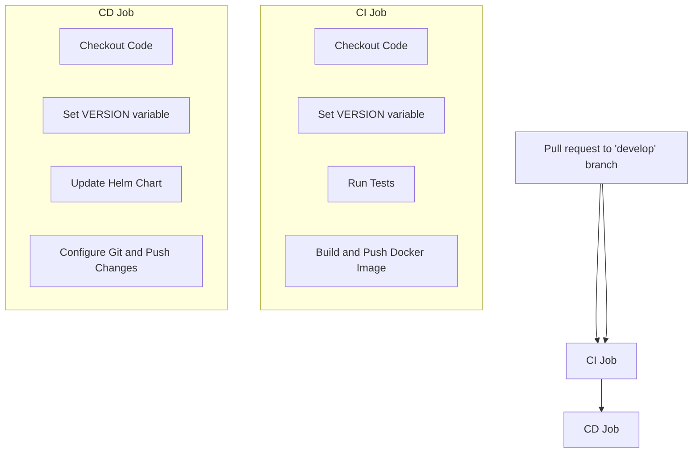

# kbot!
DevOps application from scratch

test working bot [Link To Bot](t.me/AndriiIlin_bot)

## Features
- Telegram bot integration
- Task automation
- Monitoring and alerting

## Prerequisites
- [Go](https://golang.org/doc/install) (version 1.16 or later)

## Installation

### 1. Clone the repository
```sh
git clone https://github.com/Andrey-Ilin/kbot.git
cd kbot
```

### 2. Install dependencies
```
go mod download
```

### 3. Build
```
go build -ldflags "-X="github.com/andrey-ilin/kbot/cmd.appVersion={version}
```
### 4. Export Tele Token
```
export TELE_TOKEN={your-tele-token}
```

### 5. Start
```
./kbot start
```

## Docker

For existing env var values for GOOS and GOARCH 
https://go.dev/doc/install/source#environment

### Build for Linux (default Linux/amd64):
```
make image
```

### Build for macOS:
```
make image TARGETOS=darwin TARGETARCH=amd64
```

### Build for Windows:
```
make image TARGETOS=windows TARGETARCH=amd64
```

### Build for Windows with ARM64 architecture:
```
make image TARGETOS=windows TARGETARCH=arm64
```

## Commands
- **Start the bot**: 
```
./kbot start
```
- **Get bot info**:   
```
./kbot start
./kbot
```
- **Version**
```
./kbot version
```

# KBOT-CICD Pipeline

## Overview

This pipeline automates the CI/CD process for the KBOT project. It is triggered by pushes or pull requests to the `develop` branch.




## Terraform

```
https://github.com/Andrey-Ilin/kbot-infra
```


